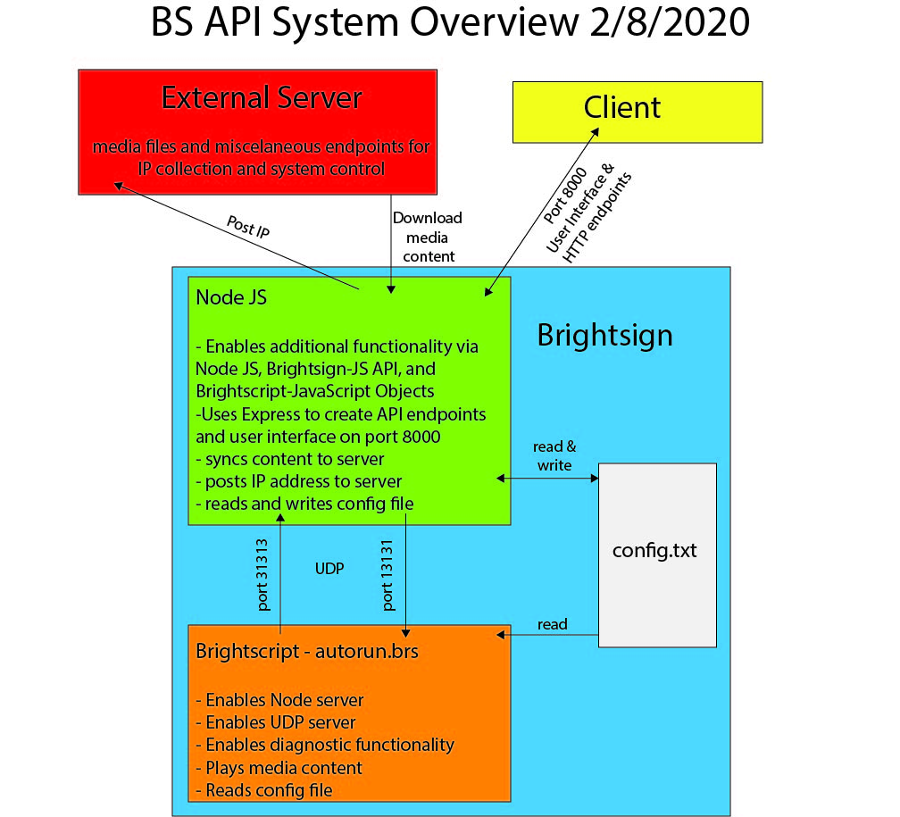

# A more functional Brightsign API

## Overview

This repository combines existing Brightsign APIs and functions to create a more functional and practical system that is more flexible and easier to implement. This provides a wide range of functionality for syncing content remotely, interacting with the brightsign, and trouble shooting, all without using BrightAuthor, because BrightAuthor is annoying and inflexible! This was designed for use with the LS423 model, but should be widely applicable to the most recent generation of Brightsign devices.

There are three main components to this system.

* The various Brightsign APIs in combination with Node JS, which provides the functionality.
* The server syncing for automated content distribution (optional)
* The HTML web interface and API end points for broader network interactions. View the [interface here](references/interface-oct2021.jpg).

	Presently, this system only works with these audio and video files: "MPG","WMV","MOV","MP4","VOB","TS", "MP3". It does NOT work with WAV files. In the future this functionality could be added via a roAudioPlayer and some logic to seperate out content types.

## Brightsign APIs as a class - BS_API.js
* the BS_API class combines a variety of BS tools with Node modules to create a more complete way to interact with the BS with a standardized syntax

### config file
* can set and get data from config file to ensure persistance

### the autorun.brs file
* roDatagram (UDP) on port 13131 enables the API via Node dgram module to communicate with the hardware.
* Other devices on the network can also communicate on this port if needed.

### media controls and interactivity
* UDP on port 13131
	* playfile syntax: 'file [filename]'
	* volume syntax: 'volume [integer in range 0-100]'
* GPIO
	* Default is set to GPIO Button to pin 0, which will play a random file
	* set gpio = true in the config file
	* GPIO pin out diagrams from https://brightsign.zendesk.com/hc/en-us/articles/218065937-GPIO-Which-pins-correspond-to-which-buttons- located in resources folder.
* HTML Control interface on port 8000
	* must add full node_modules directory + a few other modules to SD card
		* run 'npm install' on your computer and drag the node_modules directory to the SD card
		* could be rewritten with webpack in the future
	* uses PUT method 
* Additional commands can be sent via the Chrome diagnostic console.
	* see below

### playback syncing

Playback syncing is handled by the autorun script. The web interface for each devices allows for changing the playback mode (i.e. synchronization settings.)
* The start file syncronization message is sent from the leader to all devices in the sync group when the file ends and is about to restart.
* The system just syncs to the start of the current file regardless of what file is playing.
* A sync message is sent when the leader boots up.
* Devices in follower mode send a message to the leader when they boot up to ensure

Possible future additions to the syncing system:
* Add the option for "scenes" to the syncing system
	* A scene would consist of a file name, timecode, and possibly and end event (timecode, end of file, etc.) parameter
	* Currently, the best way to program this is in the index.js file

Troubleshooting playback synchronization
* https://support.brightsign.biz/hc/en-us/articles/218065907-Which-factors-can-affect-a-synchronization-

### Trouble shooting and diagnostic functions
* displays IP address on screen by default
* Chrome diagnostic console on port 3000
	* This only works on certain versions of the Chrome/ Chromium browser. See https://docs.brightsign.biz/display/DOC/HTML+Best+Practices#HTMLBestPractices-ChromiumVersionCompatibility for info on version compatibility.
	* This allows you to see error messages printed to the console and manually work with the BS_API class directly if accessible end points haven't been established.
	* some frequently used commands:
		* restart = `BS.reboot()`
		* volume = `setVolume(an int)`
		* play a file = `playFile('the filename in quotes')`
		* turn the mask zone on/off = `maskIt(boolean)`
		* `BS.configDict` returns the config dictionary 
* ssh (this must be enable via the config file if needed)
* telnet (this must be enable via the config file if needed)

### multiple zones
* multiple zones for masking/ overlays can be enable via the config file and triggered via the "mask true" UDP message or the maskIt(true) function in the API
* presently the layered zone is a PNG image, but it could easily be changed to a video or other content

### Syncing media content to server directory
* continuously checks server directory for changes
  * server directory is /[deviceID]/media
  * [deviceID] is automatically detected and does not need to be changed by the user
* downloads new files
* deletes old files

### HTML Control Interface
html control interface on port 8000

The control interface uses a Node Express server (controlInterfaceExpress.js) to serve the files in the controlInterface directory. This script also create the HTTP end points for the api and can be accessed by other devices on the network. Future work should be done to redesign and reorganize these end points.

### Brightsign Installation Instructions

* update the firmware on the BS
* update network info, password, and additional params as necessary in config.txt
* drag all of contents of the BrightsignLS423 directory to the SD card
* if you are not syncing files via the media server, put your media files onto the SD manually.

## Media Server 
The media server is not necessary for the API to run, but adds useful additional functionality. The code included in the server directory will require adapting to your specific server configuration. There are 2 main functions of the media server machine:
* 1) Distribute media content to the media players
* 2) Collect IPs from the media players for API interaction and trouble shooting purposes.
* 3) Interface displaying networked devices with links to API interface for that particular device.

The server must have a static IP, which must be listed in the BS config file.

### 1) Media Distribution
A Node.JS API facilitates the media downloading on the server side.
* This has been tested with a generic Windows IIS setup
* Place media files on server directory named "media" within a directory with the name of the device ID at the root server level.
	* root/[deviceID]/media

### 2) IP Collector
* The brightsign posts its mac address and ip address to the end point specified in postIP.js
* You can setup the end points on the server however you see fit. This repository includes 2 examples you could implement.
	* standalone Node JS app
	* iisnode app (logs available at IPADRRESS/node/deviceInfo/iisnode/)
* Presently global commands sent from the server interface are routed through this script to avoid CORS errors.

### 3) Server Interface
* Displays all the networked devices.
* If the IP collector hasn't be established, you would need to enter the device info manually.
* Presently global commands, like show IPs, are routed through the IP collector script to avoid CORS errors.

### Media Server Installation
* Node.JS on IIS -> https://github.com/Azure/iisnode
* The contents of the serverControlInterface directory need to be in the root directory of the server
* The deviceInfo needs to be 
* mediaDistribution

## Links
* Brightsign documentation https://brightsign.atlassian.net/wiki/home 
* Old documentation link https://docs.brightsign.biz/display/DOC/BrightSign+Documentation

## API Layers

### Communication between Brightscript to Node JS via UDP

Communication to and from Brightscript (autorun.brs) is handled by the roDatagram receiver and sender. Received messages are type roDatagramEvent. On the Node JS side (BS_API.js), communication is handled by the dgram package. Messages are parsed via the dgramRecieve() method.

Communication to Brightscript

* `play` - plays file from the beginning
* `pause` - pauses playback
* `resume` - resumes playback where pauses
* `seek INT` - goes to the specified point in the file in ms.
* `duration` - returns the length of the currently playing file in ms.
* `volume INT` - sets the volume.
* `timecode` - returns the current time of the media file in ms.
* `file FILENAME` - plays the specified file
* `mask SHOW-OR-HIDE` - toggles the mask off or on. Either show or hide.

### Communication between players for synchronized playback

This is handled in Brightscript (autorun.brs) by the roSyncManager

### External communication with the device

External communication between Brightsign players (except for playback sync), other servers, and browsers is handled by Node JS. HTTP endpoints are handled by an express app via controlInterfaceExpress.js. This script also server html, css, and js files for the control interface.

GET 
Example: http://192.168.1.83:8000/volume 

* /volume 
	* returns the volume 
* /file 
	* returns the local file list 
* /screen 
	* captures a new screenshot 
* /id 
	* returns the device ID/ serial number 
* /api 
	* returns the BS_API version number 
* /duration 
	* returns the duration of the currently playing file in ms
<!-- * /timecode 
	* returns the current timecode of the video in ms -->
* /bytes 
	* returns an array with the size of the media files in bytes
* /config 
	* returns the config file
* /vidInfo 
	* returns resolutions of the video file, videoplane, and output device
* /syncInfo 
	* returns information about the playback mode and playback syncronization settings
* /syncCommand 
	* triggers the leader device to sync up the followers

POST

* /command
	* {volume: INT} 
	* {comm: VALUE} 
		* reboot = reboots device 
		* ip = toggles ip display 
	* {playback: VALUE} 
		* pause = pauses video 
		* play = plays file from position 0 
		* resume = plays file from wherever it left off when paused 
	* {file: FILENAME} 
	* {queue: MS or "now", file:FILENAME]} 
	* {global: VALUE} 
		* ip = toggle IP on for 30 seconds 
	* {mute: 1 or 0} 
		* 1 = mute
		* 0 = unmute
	* {syncContent: true or false} 
		* toggles on or off the automated content syncing from a remote server
	* {seek: AN_INTEGER} 
		* Seeks to the specified integer in ms
* /sync
	* updates playback mode/ playback syncronization settings
	* {role : NORMAL_LEADER_ or_FOLLOWER ;group: NAME_OF_GROUP ; leader : IP_OF_LEADER}

### To do

* cleanup interface.js
* look in to bundling the node stuff - webpack
* add interface for user to enter metadata for location and other info as needed
* MQTT

